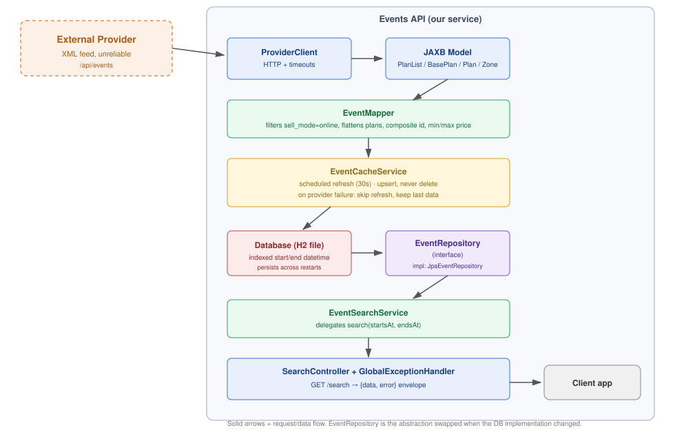

# Events API

REST API that aggregates events from an external XML provider and exposes a unified search
endpoint (`GET /search`), filtered by date range, in normalized JSON.

## Notes on approach

A few decisions map directly to Fever's stated evaluation criteria:

- **Dependency minimalism**: only Spring Boot starters, Lombok, and a DB driver — no
  mapping/utility libraries where hand-written code was equally clear.
- **Abstraction for testability/scalability**: `EventRepository` is an interface, so the
  persistence strategy can change (as it did, mid-project) without touching business logic.
- **Testing** targets core logic and edge cases actually found in the provider's real data,
  not coverage numbers.

## Tech stack

Java 11 · Spring Boot 2.7.18 · Spring Data JPA · H2 (file-based) · JAXB · Lombok ·
JUnit 5 + Mockito + AssertJ

## How to run

```
make run
```

Runs `./mvnw spring-boot:run`. App starts on `http://localhost:8080`. No manual setup beyond
Java 11 — the database is a local file created automatically on first run.

```
make test    # test suite
make build   # package the app
```

*`make` itself couldn't be verified on my Windows machine (no WSL/Docker — BIOS virtualization
limitation); the underlying Maven command was tested directly and works. Standard Makefile
syntax, expected to run in any Unix-like shell.*

## API

**`GET /search`** — required params: `starts_at`, `ends_at` (ISO-8601 date-time).

```
GET /search?starts_at=2021-06-30T21:00:00&ends_at=2021-06-30T22:00:00
```

```json
{
  "data": { "events": [
    { "id": "291_291", "title": "Camela en concierto",
      "start_date": "2021-06-30", "start_time": "21:00:00",
      "end_date": "2021-06-30", "end_time": "22:00:00",
      "min_price": 15.00, "max_price": 30.00 }
  ]},
  "error": null
}
```

Errors use the same envelope (`data: null`, `error: "..."`) with the matching HTTP status —
400 bad input, 503 provider unavailable with no cached data yet, 500 unexpected.

## Architecture



```
Provider (XML) → JAXB model → EventMapper → EventEntity (JPA)
    → EventRepository (interface) → EventSearchService → SearchController
```

A scheduled job (`EventCacheService`, every 30s) fetches the provider's full feed, normalizes
it, and **upserts** it into the DB — existing rows are updated, new ones inserted, and nothing
is ever deleted, so past plans stay retrievable even after they drop out of the provider's
response. If the provider call fails, the refresh is skipped and the last persisted data keeps
serving — search stays fast and available regardless of provider uptime.

The provider doesn't support server-side filtering and always returns its full dataset, so the
feed is pulled on a timer rather than per-request; filtering happens locally against
already-persisted data.

`EventRepository` is an interface specifically so the data source can be swapped — e.g. for a
different DB — without touching `EventSearchService` or the controller.

## Database

File-based H2 (`./data/events-db.mv.db`) — persists across restarts, not just within a run.

Originally designed for PostgreSQL via Docker Compose (`docker-compose.yml` included). Switched
to H2 after a BIOS-level virtualization limitation blocked WSL2/Docker locally. The JPA layer is
DB-agnostic — reverting is a connection-string and driver change, nothing else.

`startDateTime`/`endDateTime` are stored as combined, indexed columns (alongside the separate
date/time fields the API returns) so range queries can run as a single indexed comparison
instead of comparing split columns.

`ddl-auto=update` is used for schema management; a production system would use Flyway instead.

## Key design decisions

- **One event per provider `plan`, not per `base_plan`** — a `base_plan` can have multiple
  sessions with different dates (confirmed in real data, e.g. "Pantomima Full").
- **Composite ID (`base_plan_id_plan_id`)** — the provider's `plan_id` is not globally unique;
  the same `plan_id` appeared under two different `base_plan_id`s in real responses. Caught by
  comparing multiple live provider calls before writing the mapper.
- **`sell_mode` as an enum**, not a raw string — avoids typo risk; only `online` events return.
- **`min_price`/`max_price` aggregated from zones** rather than exposing zone-level detail —
  matches the response contract and keeps a listing view legible.
- **`BigDecimal` parsed from the raw price string**, not `double` — avoids float rounding on
  money.
- **Inclusive date-range boundaries** — the spec's wording is ambiguous on this; events starting
  or ending exactly at the boundary are included.
- **Lombok `@Getter`/`@Setter` on JAXB models is safe** — JAXB uses `@XmlAccessType.FIELD`
  (binds via reflection), never calling the getters/setters Lombok generates.
- **Hand-written mappers over MapStruct** for logic-heavy mapping (filtering, aggregation,
  multi-object merges). The `EventDto ↔ EventEntity` mapper is a near-1:1 copy and would've been
  a reasonable MapStruct candidate — hand-written here for consistency.

## Testing

- **`EventMapperTest`** — `sell_mode` filtering, multi-plan fan-out, the composite-ID collision
  fix, price aggregation.
- **`EventJpaRepositoryTest`** (`@DataJpaTest`) — range query, inclusive boundaries, null-end-date
  handling, against a real embedded test DB.
- **`SearchControllerTest`** (`@WebMvcTest`) — response envelope, empty results, error handling
  for missing/malformed params.

```
make test
```

## AI usage disclosure

Used Claude (Anthropic) as a pair-programming aid — explaining unfamiliar Spring/JPA/JAXB
concepts, discussing trade-offs, and drafting boilerplate-heavy classes that I then reviewed and
adjusted. Design decisions, debugging, and validation against the live provider's actual data
were done directly by me. I can walk through the reasoning behind any part of this codebase.

## Scaling further (not implemented)

- **Thousands of plans / hundreds of zones**: current mapping is O(n) and fine at that scale;
  the real change would be a streaming XML parser (StAX) instead of buffering the full response.
- **5k–10k req/s**: reads already never touch the provider (DB only) — the stateless service can
  scale horizontally behind a load balancer, with a cache (e.g. Redis) in front of the DB for hot
  date ranges if needed.
- Both fit behind the existing `EventRepository` interface without touching business logic.

## Known limitations

- PostgreSQL was the intended DB; blocked locally by a BIOS virtualization limitation, not a
  design choice — `docker-compose.yml` reflects the original plan.
- Flyway migrations instead of `ddl-auto=update`, for production-safe schema evolution.
- Validation errors could distinguish malformed input from a logically invalid range
  (`ends_at` before `starts_at`).

 ## Testing
 - You need to add a valid provider with the structure of its gonna receive on application properties

